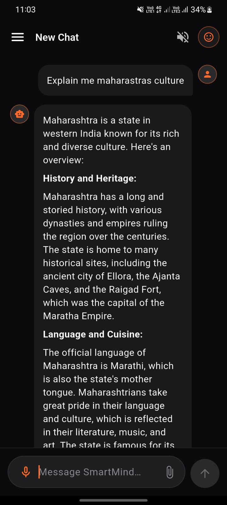
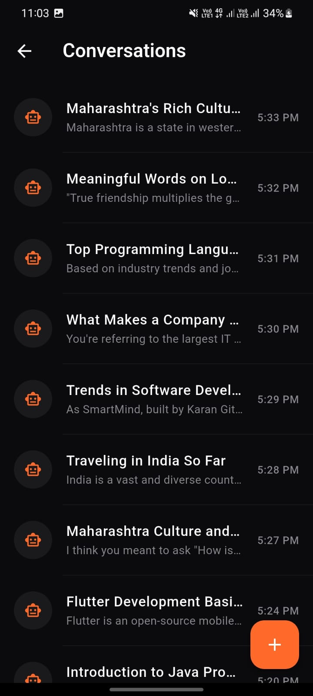
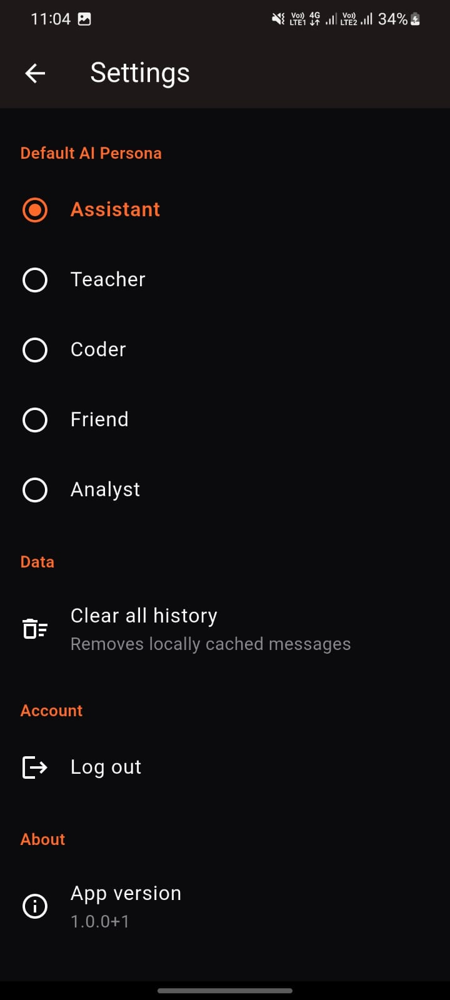
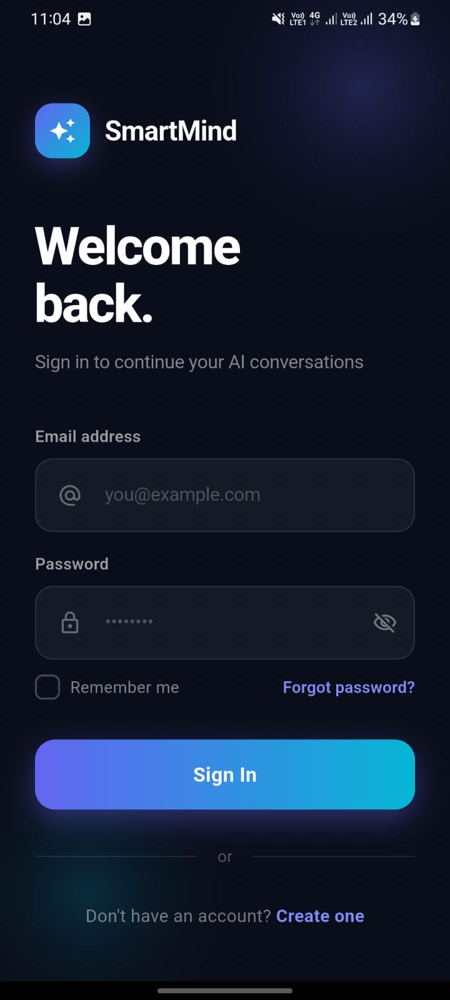
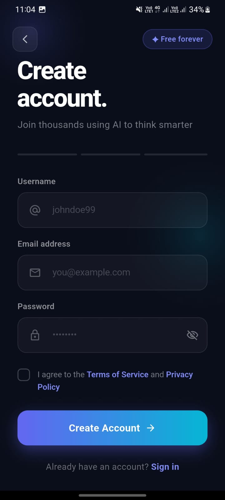

# SmartMind AI — Personal AI Assistant


A cross-platform, production-ready AI assistant app built with **Flutter** and a **Spring Boot** backend — featuring real-time conversational AI, voice input/output, multi-persona chat, offline caching, and persistent authentication.

**Live Backend API:** [https://smartmind-backend-production.up.railway.app](https://smartmind-backend-production.up.railway.app)

---

## Screenshots

| Chat with AI | Conversation History | Empty State |
|---|---|---|
|  |  |  |

| Quick Options Menu | Settings & Personas | Login |
|---|---|---|
|  |  |  |

| Register |
|---|
|  |

---

## Overview

SmartMind AI is a personal AI assistant application designed to feel like a polished, commercial-grade product — not a demo. It combines a Flutter frontend with a secure Spring Boot + PostgreSQL backend, and integrates a hosted LLM (Llama 3.1 via Groq) for real-time conversational responses.

The project was built end-to-end: architecture, backend API, database schema, authentication, deployment, and a fully custom dark-themed UI — all designed and implemented independently.

---

## Features

### Core
- **JWT-based authentication** — secure register/login with persistent sessions (no repeated logins on app restart)
- **Real-time AI chat** — powered by a Groq-hosted LLM (Llama 3.1)
- **Multi-conversation history** — create, rename, delete, and revisit past conversations
- **User profile management**

### Advanced
- **Voice input & output** — speak to the assistant using speech-to-text, and hear AI responses read aloud via text-to-speech
- **Context-aware conversations** — AI retains relevant context across a conversation
- **Markdown rendering** — AI responses render with proper formatting (bold, code blocks, lists, etc.)
- **Offline mode** — last messages cached locally with Hive; cached chats are viewable without an internet connection
- **Multiple AI personas** — switch between Assistant, Teacher, Coder, Friend, and Analyst modes, each with distinct response behavior
- **Smart auto-titling** — conversations are automatically titled based on their content
- **Pinned messages** — mark important AI responses for quick reference
- **Code execution preview** — syntax-highlighted code blocks with one-tap copy

### Planned / In Roadmap
- AI memory across sessions (long-term user facts and preferences)
- AI tool use — weather, calculator, and web search integration
- Multi-language support (Hindi, Marathi, English)
- Home-screen quick chat widgets (Android/iOS)
- Wearable (WearOS) quick voice query support
- Conversation export (PDF/text)

---

## Tech Stack

**Frontend**
- Flutter 3.x (Android, iOS, Web)
- BLoC (`flutter_bloc`) for state management
- Dio for HTTP networking
- Hive for local/offline storage
- `flutter_markdown` for rich text rendering
- `speech_to_text` + `flutter_tts` for voice input/output
- `image_picker` for file/image uploads
- `shared_preferences` for session persistence
- `connectivity_plus` for offline detection

**Backend**
- Java Spring Boot 3.3
- Spring Security + JWT authentication
- Spring Data JPA + Hibernate
- PostgreSQL 16
- Groq API (Llama 3.1) for AI response generation
- Deployed on Railway with GitHub Actions CI/CD

---

## Architecture

```
FLUTTER APP (Client)
   │  Chat UI · Voice · History · Profile
   ▼  REST API / WebSocket (HTTPS)
SPRING BOOT BACKEND (API)
   ├── Auth Filter (JWT)
   ├── Chat Controller
   ├── AI Service ───────► Groq API (Llama 3.1)
   └── User Service
   │
   ▼
PostgreSQL Database
```

The app follows clean, modular architecture on both ends:
- **Flutter:** `core / data / domain / presentation` layered architecture with BLoC for predictable, testable state management.
- **Backend:** Standard layered Spring Boot architecture — Controller → Service → Repository — with JWT-secured endpoints and a normalized PostgreSQL schema (users, conversations, messages, user memories).

---

## API Reference (Summary)

**Auth**
| Method | Endpoint | Description |
|---|---|---|
| POST | `/api/auth/register` | Register new user |
| POST | `/api/auth/login` | Login, receive JWT |

**Chat**
| Method | Endpoint | Description |
|---|---|---|
| POST | `/api/chat/send` | Send message, get AI reply |
| GET | `/api/chat/conversations` | List all conversations |
| POST | `/api/chat/conversations` | Create new conversation |
| GET | `/api/chat/conversations/{id}/messages` | Get messages |
| DELETE | `/api/chat/conversations/{id}` | Delete conversation |
| PUT | `/api/chat/conversations/{id}` | Update title/persona |

**User**
| Method | Endpoint | Description |
|---|---|---|
| GET | `/api/users/me` | Get current user profile |
| PUT | `/api/users/me` | Update profile |
| DELETE | `/api/users/me` | Delete account |

---

## Getting Started

### Prerequisites
- Flutter SDK 3.x
- Android Studio / VS Code / Eclipse
- A running instance of the backend, or use the live API above

### Installation

```bash
git clone https://github.com/karanrgite/smartmind-ai-flutter.git
cd smartmind-ai-flutter
flutter pub get
flutter run
```

By default, the app points to the live production backend. To use your own backend instance, update the `baseUrl` in:

```
lib/core/constants/api_constants.dart
```

**Backend repository:** [smartmind-backend](https://github.com/karanrgite/smartmind-backend)

---

## Project Structure

```
lib/
├── core/            # Constants, network client, theming, utilities
├── data/            # Models, repositories, local & remote data sources
├── domain/          # Use cases (business logic)
└── presentation/    # Screens, BLoC state management, reusable widgets
```

---

## Author

**Karan Gite**
Flutter Developer

Flutter developer with 1+ year of production experience building cross-platform logistics and marketplace applications for Android and iOS. Proficient in Flutter, REST APIs, Firebase, and Spring Boot backends.

- Email: karangite17@gmail.com
- Phone: +91 7756969005
- GitHub: [github.com/karanrgite](https://github.com/karanrgite)
- Location: Pune, Maharashtra, India

### Other Projects
- **LogiTrack** — Logistics & Transportation Management System (production app at AV SoftTech): cross-platform Flutter app with ML-based face detection for attendance, vehicle booking, real-time delivery tracking, barcode scanning, and automated label printing, backed by MySQL and local Hive storage.
- **PujaPath & TaxUtsav** — Two production Flutter apps built at Dipvision Infotech, integrating Razorpay payments, Firebase Cloud Messaging, JWT auth, and cloud deployment pipelines.

---
# A license note in the README
"This project is a personal portfolio piece. Feel free to view the code, but please don't copy or redistribute without permission."
